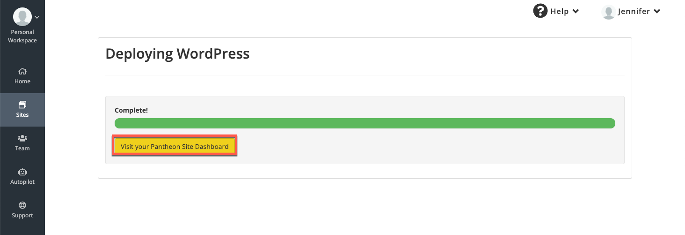

Custom Upstreams act as a scaffold for new sites, allowing developers and site owners of any skill level to kickoff projects at warp speed.

Instead of repeating the same technical work on each individual site, you can build and maintain a common user interface with unified branding and functionality once, in a single source.

To create a site using a Custom Upstream:

1. Go to the Professional Workspace that contains the Custom Upstream, and select the yellow <Icon icon="plus" text="Create New Site"/> button on the lower right side of the page.
   

1. Select **Custom Upstream**.
1. Select the upstream you wish to use.
1. Enter the name and select a region for this site, then click **Continue**. It can take several minutes to create a new site on Pantheon.

   

   <Alert title="Note" type="info" >

   You can navigate away from this page during this process, but later, you'll have to go to the **Sites** tab to access your site.  If possible, stay on this tab to simplify accessing the site when the creation is complete.

   </Alert>

1. Click **Visit your Pantheon Site Dashboard** when the process is complete.

   

## Install the CMS for the Dev Environment

<Partial file="cms-dev.md" />

## Initialize the Test environment

<Partial file="test-initialize.md" />

## Install the CMS for the Test environment

<Partial file="cms-test.md" />

## Initialize the Live environment

<Partial file="live-initialize.md" />

## Install the CMS for the Live environment

<Partial file="cms-live.md" />

At this point, you have a live site with a Pantheon URL, like `http://my-site.pantheonsite.io/`. To change that to a more friendly URL, you'll need to purchase a domain from a DNS provider.  Refer to our [Domains on Pantheon Guide](/guides/domains) for more information.

