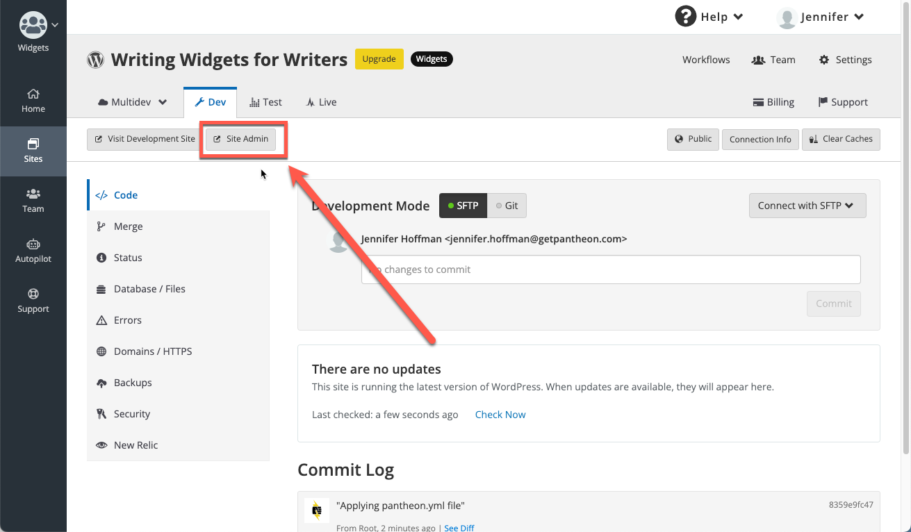

<Alert title="By the end of this chapter, you will be able to:"  type="info" >

* Create a new site on Pantheon through the Pantheon Dashboard.
* Create a new site on Pantheon programmatically using Terminus.
* List and Describe the different starting states from which you are able to spin up a new site on Pantheon.
* Describe the WebOps Workflow on Pantheon as it relates to Code, Files, and Databases.

</Alert>

In making a new site on Pantheon, you have a few options:
* Selecting the CMS (Drupal or WordPress) you will be using
* Backend (CMS) site vs. Front End Site
* Starting with a fresh CMS install or starting from a Custom Upstream

At the end of this section, you will be able to create a new CMS Site through the Pantheon Dashboard.

### Create a Site

<Alert title="Tutorial Activity #2: Create a Site in the Pantheon Dashboard"  type="info" >

This section will walk you through the steps of creating a new site on Pantheon through the dashboard. By the end of this activity, you will have a working installation of Drupal or WordPress to start your WebOps development. Creating sites in the Pantheon Dashboard is one of two ways to create a new site on Pantheon. You will learn how to create a site the other way, on the command line through Terminus, in a later section.

</Alert>

A Pantheon CMS site contains three components: code, files, and a database containing the content and configurations of your CMS (Content Management System). When you create a site, you are creating each of these components in the Dev environment. Then, when you are ready, you will create your Test and Live environments.

<Partial file="dashboard-site-creation-1.md" />

### Enable New Relic

<Alert title="Tutorial Activity #3: Enable New Relic"  type="info" >

Now that we have created our first site on Pantheon, let’s enable New Relic. New Relic® Performance Monitoring offers a wide array of metrics that provide a nearly real-time look into the performance of a web application. New Relic® makes it easy for you to monitor your performance and speed up the support process by helping our support team visualize corresponding performance and symptoms.

</Alert>

<Partial file="new-relic-enabling.md" />

Once New Relic has been successfully enabled on your site, you should see the following:

  

For more information on leveraging the power of New Relic with WebOps on Pantheon, see the following guide: https://docs.pantheon.io/guides/new-relic.

### Install the CMS

<Alert title="Tutorial Activity #4: Install the CMS"  type="info" >

As we learned previously, Drupal and WordPress consist of three distinct components: Code (e.g. PHP, JavaScript, CSS), Content (data), and Files (e.g. images). Now that we have provisioned a new site on Pantheon through the dashboard, we will now install the CMS site itself.

**Q: Why was the site not already installed?**

Great question! When a new site is provisioned on Pantheon, WebOps automation creates all of the resources needed for the site, including code and database servers, a site dashboard, etc. Installing Drupal or WordPress requires an additional step - the installation process to configure your site's core settings, themes, plugins, and initial content. We will complete this process here.

</Alert>

There are a few different ways to install a Drupal or WordPress site. These include:

* Site Install Wizard: Initializing the site installation process through the Administrative dashboard. Both CMS’s automatically redirect you to an installation wizard that takes you through the steps of provisioning your new site. This is the process we will follow in this activity.
*Command Line: Drupal (Drush) and WordPress (WP-CLI) both include command line interface tools that include commands to install a new site at the database level. These are drush site:install and wp core install, respectively.
* Existing Site Archive: Pantheon provides many tools and support for manually migrating existing sites to the platform. For more information, see this guide: https://docs.pantheon.io/migrate-manual/

In this section, we will walk through the first method, installing a fresh WordPress site through the WordPress Administrative Dashboard wizard.

1. In your site dashboard, navigate to the Dev tab and click the Site Admin button:

   

1. This will open up a new browser tab containing the WordPress installation process form.

1. You will see a “Success” message once the site has been installed. Once the site has been installed, you will be able to login to your WordPress admin dashboard directly through the Pantheon dashboard’s Site Admin button, or through the standard WordPress login URL (e.g. https://environment-sitename.pantheonsite.io/wp-login.php).

Congratulations! You have now successfully installed WordPress on your Pantheon sit
