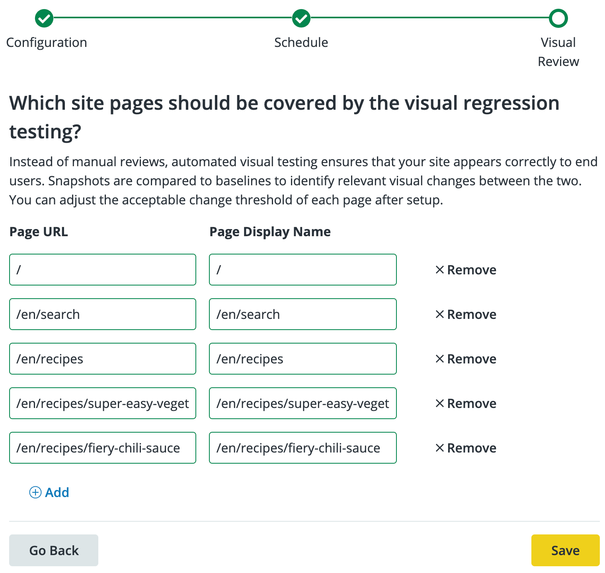

There are several things you can do to prepare your site and your team for Autopilot before it is enabled.

## Pre-define Your URLs for Virtual Regression Testing

Autopilot allows you to define specific URLs for individual regression tests. You can define as many URLs for individual regression testing as you want during the [Visual Review](/guides/autopilot/enable-autopilot/#visual-review) section of the Autopilot Wizard.

You can pre-define these URLs when you begin preparing your site for Autopilot. 

 We recommend that you include pages that:

- Receive frequent changes

- Contain key information that should be thoroughly reviewed

- Appear as top links on your homepage

- Receive major content updates 

## Consider What Web Elements You Want to Exclude

Certain [web elements can be excluded](/guides/autopilot/enable-autopilot/#excluded-web-elements) from your visual regression testing. We recommend creating a list of web elements that you can exclude from testing before you begin to configure Autopilot. 

Dynamic elements are created by your browser and only exist during runtime. Consider excluding the following dynamic web elements from your tests:

- Banner images

- Elements created using JavaScript

- CSS and Pseudo-Elements

- Static Elements with Dynamic Parts 

    - You can have static elements defined in your source code, but the attributes and data inside this element might be modified or set by JavaScript. For example, using `setAttribute` to change an attribute on a static element.

### Adjust the Threshold for Dynamic Content

There might be some dynamic web elements that you don't want to completely exclude. You can [adjust the threshold for acceptable change](/guides/autopilot/enable-autopilot/#acceptable-change) in this case. Adjusting the testing threshold will help distinguish between true test failures and false positives caused by dynamic web elements or other factors. 

You will be notified of test failures that fall below the set threshold if you subscribe to Autopilot notifications.

### Review Exclusions for Composer with Extra Care

Sites managed through Composer have less flexibility when setting exclusions in Autopilot. You can exclude Composer-installed modules or your Upstream at the highest level to keep them from being updated. However, you should avoid getting too granular with your exclusions to avoid merge conflicts.

## Determine Stakeholders for Your VRT Feedback Loop

Autopilot's visual regression tool takes before and after screenshots to check for changes. You can accept the changes page by page or accept all changes for all pages an once depending on your requirements and thresholds. It's a good idea to have multiple team members review changes when a lot of updates and content changes have been made. You can share the test results and preview pages with stakeholders to ensure that your site has wide approval before accepting the changes.

1. Click **More Actions** in the **Review Test Results** page to see Autopilot data for a specific site.

1. Click **Visit Autopilot Site** under the **Autopilot** tab in the Dashboard to view the site in a new browser tab.

1. Share this preview link with stakeholders and request their approval.

    

1. Encourage your stakeholders to [enable Autopilot notifications](/guides/autopilot/enable-autopilot/#enable-autopilot-email-notifications).

## More Resources

- [Autopilot Setup and Configuration](/guides/autopilot/enable-autopilot)

- [Autopilot FAQs](/guides/autopilot/autopilot-faq)

- [Composer Fundamentals and WebOps Workflows](/guides/composer)