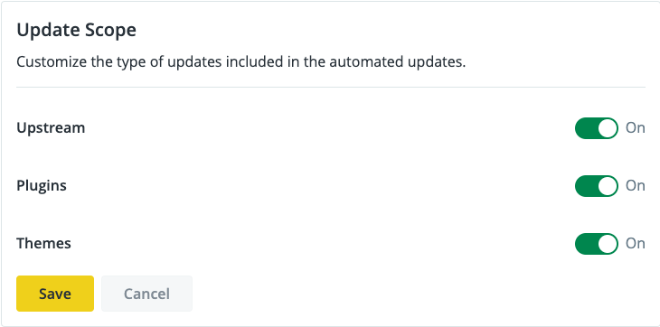
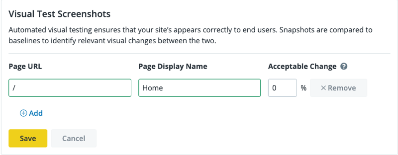
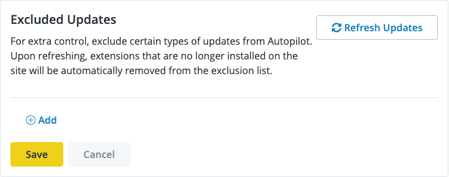

## Enable Autopilot

Autopilot can be enabled for individual sites within each eligible Workspace.

To work with Autopilot, [switch to the Workspace](/guides/new-dashboard/workspaces#switch-between-workspaces) for the site's Organization before you continue.

1. If the site is in [SFTP mode](/sftp) with staged changes that haven't been committed yet, [commit those changes](/sftp#committing-sftp-changes) first.

1. In the Global Primary Navigation, click the <i className="fa fa-robot"></i> **Autopilot** icon.

1. Sites for which Autopilot is available are listed in the **All Sites** column of the **Sites** table.

1. Click **Activate** in the Site's row.

  During setup, use the buttons at the bottom to navigate between steps. If you use the browser's back button instead of **Go Back**, you'll lose the unsaved changes.

1. In the **Configuration** step, use the **On**/**Off** toggles to choose which features and elements should be tracked for, or excluded from, updates then click **Continue** to set a schedule and deployment destination for Autopilot.

  Any elements that Autopilot detects as available for exclusion will be listed in each category (Modules, Plugins, Themes). Click **Manage Excluded Updates** then the **Exclude** button on the element's row to exclude it from Autopilot updates.
  
  

1. Schedule Autopilot to run:

   - Never (Update Manually)
   - Monthly
   - Weekly
   - Daily ([Contact Sales](https://pantheon.io/contact-sales?docs))

   Then use the dropdown menu to choose the deployment destination:

   - Dev
   - Test
   - Live

   

   Click **Continue** to choose pages for screenshot comparison tests.

1. Add pages to track for visual regression testing. Autopilot automatically suggests up to ten URL paths during setup:

  

  Click **Save** to initialize Autopilot on the Site.

1. Click **Status** in the Autopilot sidebar for the current status of the testing. This process might take a while:

  

## Autopilot Configuration - Manage Autopilot Settings

From the **<i className="fa fa-robot"></i> Autopilot** page of the Workspace, click **Actions** <i className="fa fa-chevron-down fa-w-14"></i>, then **Manage Autopilot Settings**.

The Autopilot Configuration page shows all the steps from the initial setup on one page.

If the Site uses [Integrated Composer](guides/integrated-composer) (including all Drupal 9 sites), Autopilot will show warnings in the sections where Composer manages updates.

Click **Save** for each section of the configuration in which you make changes.

### Update Scope

Use the **On**/**Off** toggles to choose which features and elements should be tracked for updates then click **Save**.

### Destination & Frequency

Use the **Deployment Destination** dropdown menu to choose which environment Autopilot should deploy up to:

- Dev
- Test
- Live

Set the **Update Frequency** to schedule Autopilot to run:

- Never (Update Manually)
- Weekly
- Monthly

Click **Save** to save the changes.

### Visual Test Screenshots

Add pages to track for visual regression testing, along with a percent of acceptable change.

Click **<i class="fa fa-plus-circle"></i> Add** to add more pages.

Click **Save** to save changes.

#### Acceptable Change

Autopilot allows you to configure a threshold of acceptable change so that small, expected changes don't trigger false positives. This is useful for common changes like:

- Randomized testimonials feeds
- Sliders
- Social (Twitter, Facebook, Pinterest, etc.) feeds
- Advertising

For percent change, consider that a 1% change is like a 1000 pixel wide image shifting 10 pixels over.

You can adjust this setting later for individual tests.

Additional DOM element exclusion is in active development.

### Excluded Updates

Autopilot checks for plugins, modules, and themes that are eligible for exclusion. Choose which should be excluded.

Click <i class="fa fa-sync-alt"></i>**Refresh Updates** to scan for available updates that can be excluded from Autopilot.

Select any that should be excluded, then click **Save**.

### Excluded Web Elements

Add any CSS selectors that you want to exclude from the visual regression tests.

List the CSS selectors you want to exclude from VRT, using a comma or line break to separate elements in the list.

Click **Save**.

## Configure Autopilot for Premium and Paid Plugins and Modules

Configure Autopilot for each individual premium and paid plugins and modules. Depending on the plugin, you may need to provide Autopilot with access or configure the plugin or module to work with Autopilot.

## Enable Autopilot Email Notifications

<Partial file="autopilot/autopilot-email-notifications.md" />
