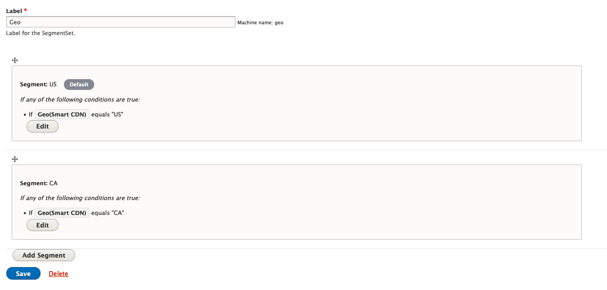
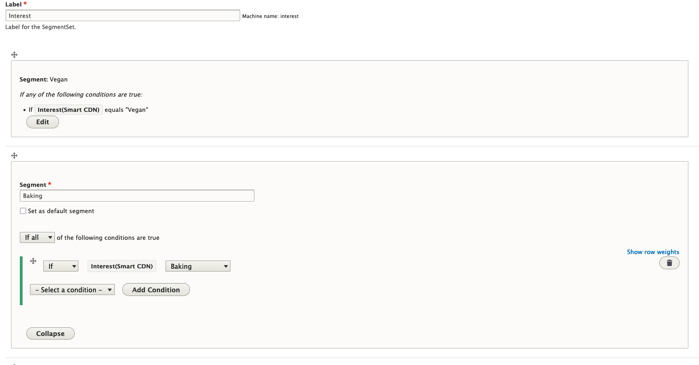
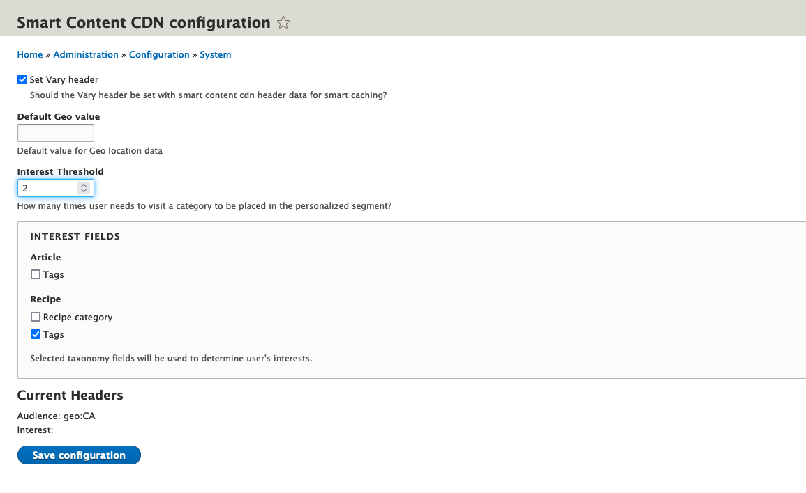

This guide is made to facilitate the onboarding process for developers who are implementing content personalization via Pantheon's Advanced Global CDN into their own Drupal website. The personalization system consists of two main parts:

- Pantheon Edge Integrations library - a CMS-agnostic PHP library that allows reading, process, and set VARY headers to be recognized by Pantheon Advanced Global CDN.
- A collection of Drupal 8+ modules in the [Smart Content](https://www.drupal.org/project/smart_content) ecosystem that provide Smart Personalization blocks and preview functionality.


## Before You Begin

1. Ensure you have a working Drupal 8+ installation ready.

1. Install [Smart Content CDN module](https://github.com/pantheon-systems/smart_content_cdn) and its dependencies, which can be pulled with [Composer](https://getcomposer.org/) from their corresponding Pantheon repositories. This includes:
    - [Pantheon Edge Integrations PHP library](https://github.com/pantheon-systems/pantheon-edge-integrations)
    - [Smart Content](https://www.drupal.org/project/smart_content)
    ```
    composer require pantheon-systems/smart_content_cdn
    ```

## Configure Smart Content CDN

1. Enable the Smart Content CDN module.

1. Enable Smart Content and Smart Content Blocks module.

1. Enable the Smart Content Preview.

1. Navigate to the Smart Content CDN configuration page at *Configuration > System > Smart Content CDN configuration* at `/admin/config/system/smart-content-cdn`.

1. Enable the Vary Header toggle.

1. Set default Geo value to a 2-letter country code in all uppercase (e.g. US). This should match the default segment in Step 8 of the [Geolocation](/guides/edge-integrations/module-install/#geolocation) section.

1. Save the configuration.

## Smart Content CDN Usage

There are a few different ways to use Smart Content CDN. In this doc, we will cover targeting via Geolocation, and Interest via Taxonomy.

### Geolocation

To configure geolocation segments:

1. Navigate to `/admin/structure/smart_content_segment_set`.

1. Click **+Add Global Segment Set**.
    

1. Provide a label (e.g. Geo).

1. Click **Add Segment**.
    

1. Change the segment name to something meaningful (e.g. Canada, US, etc).

1. Select **Geo** condition under the Smart CDN category.
    

1. Click **Add Condition**.

1. Fill in value for **Equals**. Fastly is currently set up to return 2-letter country codes for geolocation. If your country is USA, type in “US” in all uppercase letters.
    

1. Add all of the required segments and select one that will act as the default.

1. Make sure that Preview checkboxes are unchecked.

1. Click **Save**.

1. Navigate to the *Structure > Block layout > Add custom block* at `/block/add`.

1. Add content blocks for each segment. For instance "Hello Canada!", "Hello US!", etc.

1. Navigate to the **Block Layout** section of the site `/admin/structure/block`.

1. Click **Place block** in the region you want the geo-block to appear, and search for **SSR Decision Block**.

1. Configure the Decision Block: select your new Geolocation Segment set; click **Select Segment Set**.

1. In the Configure Reactions section, click Edit, and add the “Hello…” blocks you created to the corresponding segment.

1. Add placement configuration to the block and save the block.

1. Navigate to the page with the block and you will see the personalization you configured.

1. If you don’t have a VPN client, navigate to the Segments Sets admin page `/admin/structure/smart_content_segment_set`, edit the set, select one preview checkbox, and save.

The content corresponding to this segment will display. Please note that only users who are logged in can access the content in preview, anonymous users will not have access.

### Interest via Taxonomy

In this section, we identify the content type where you want to use personalization by Interest,  add a taxonomy field, and connect it to the pertinent vocabulary. For this example, we will assume it is Tags `field_tags`.

1. Navigate to *Admin > Config > System > Smart Content CDN* at `/admin/config/system/smart-content-cdn`. In the configuration form for Smart CDN, select the checkbox for Tags. The form automatically reads all available taxonomy reference terms for all content types and allows you to select them.
    

1. Create tags for your Tags vocabulary.

1. Review your content and tag it using the Tags vocabulary (e.g. "Biking").

1. Navigate to `/admin/structure/smart_content_segment_set,` to configure geolocation segments. 

1. Click **+Add Global Segment Set**.

    

1. Provide a label (e.g. Interest) - the name isn't critical.

1. Click **Add Segment**.
    

1. Change segment name to something meaningful. We recommend matching the term name (e.g. "Biking").

1. Select Interest condition under the Smart CDN category.

1. Click **Add Condition**.

1. Fill in value for **Equals** with the taxonomy term name.
    

1. Set default segment and save.

1. Create content blocks per segment; they can also be views or block types.

1. Add another **SSR Decision Block**, select Interest segment, and configure reactions. Place block and save.

1. Navigate to the page with the block and you will see the personalization you configured.

1. If you don’t have a VPN client, navigate to the Segments Sets admin page `/admin/structure/smart_content_segment_set`, edit the set, select one preview checkbox, and save.

The content corresponding to this segment will display. Please note that only users who are logged in can access the content in preview, anonymous users will not have access.

## Additional Configuration

There is some additional configuration that you can apply to Smart Content. The Interest is of particular importance. It is calculated by the frequency with which the page tagged with a certain term is visited.

To set up the threshold after which the user will be placed in the particular Interest segment:

1. Navigate to the *Configuration > System > Smart Content CDN* configuration at `/admin/config/system/smart-content-cdn`.
    

1. Update the Interest threshold value.

1. Clear the cache.

<!--

### Subscriber

Note: Subscriber method is paywalled, and currently not covered in the documenation.

<Alert title="Note"  type="info" >

The Role/Subscriber use case requires a JWT module and a private key. It also requires additional configuration on the AGCDN side. It’s currently under active development and will be delivered in future phases.

</Alert>

Subscriber use cases are different from the Geolocation and Interest because there are only two segments: subscribers and anonymous users. You don't need to add a segment set for it if you want to use it to hide content behind the paywall. If you want to show different blocks to subscribers, you can set up the segments similar to how the Geolocation and Interest use cases are done, and select the Role condition.

Role authentication is done on the CDN level via the JWT token. Follow the setup instructions for the module and generate a JWT RSA Key. This key needs to be implemented on the AGCDN layer.

The custom key you create is automatically stored in the `subscriberToken` cookie by the module. To verify that the token generation works and is encrypted using the RSA key:

1. Install and enable the [JWT module](https://www.drupal.org/project/jwt).

1. Navigate to *Configuration > System > Smart Content CDN configuration* at `/admin/config/system/smart-content-cdn`.

1. Update subscriber threshold, which is the number of free articles the anonymous user can view.

1. Select content types that need to be locked behind the paywall.

1. Save configuration; the content is now protected by a paywall.

1. The users that have a Subscriber role can log in using the Drupal login form.

1. Editors and administrators can use the Smart CDN Preview module to masquerade as a subscribed user.
-->

## Conclusion

The Smart Content CDN module extends Smart Content's functionality, and leverages the [Pantheon Edge Integrations](https://github.com/pantheon-systems/pantheon-edge-integrations) PHP library. The setup steps above provide two use cases: Geolocation and Interest, but there is much more you can accomplish with Smart Content and content personalization. For more information about the module, and other possible use cases, refer to the [Smart Content CDN module](https://github.com/pantheon-systems/smart_content_cdn).    