Pantheon’s Edge Integrations offers advanced and powerful features for content personalization. At this time, 2 key primary features are supported: Geo and Interest. These features allow us to serve different content to each user at given URLs. Google Analytics won’t differentiate between the personalized versions of a page unless you instruct it otherwise. This section aims to help you enhance your configuration to track personalization experiences via Google Tag Manager.

## Requirements

* Access to your site’s Google Analytics and Tag Manager accounts, and basic knowledge of these products. 
* You have the Smart CDN module enabled and a personalization use case active and working on your Pantheon-hosted, Advanced Global CDN-enabled website. 

Personalization strategy and implementation are outside the scope of this page. For more information on that, refer to the [Introduction](/guides/edge-integrations/introduction/) part of the guide.

### Before You Begin

Consider the desired goals and objectives for your users. Define success for your organization and how you want to measure it. Do your personalization tactics aim to convert your users to sign up for your newsletter, download a whitepaper, or achieve some other goal? You may already have tracking in place to measure against these key performance indicators; you will be extending them here.

## Configure Your Website

<TabList>

<Tab title="WordPress" id="wp-analytics-config" active={true}>

### Add Google Tag Manger(GTM) Code

The [Pantheon WordPress Edge Integrations plugin](https://github.com/pantheon-systems/pantheon-wordpress-edge-integrations) natively supports Google Analytics via Google Tag Manager. 

1. Navigate to the General Settings page in your WordPress admin and scroll to the **Google Tag Manager Code** field.


Alternately, you can use the `pantheon.ei.gtm_code` filter. This filter can be used to either override the above setting in the admin, or to define a GTM code in your codebase.

To override the GTM code option and prevent the built-in Google Analytics code from being displayed on your site, use the `__return_true` built-in callback on the filter:

```php
add_filter( 'pantheon.ei.gtm_code', '__return_true' );
```

This is helpful if you are using another plugin to add Google Analytics or GTM code snippets, or if you have hard-coded those code snippets into your site and do not need them to be added for you.

Use the following example if you want to define the GTM code in the codebase and use the built-in integration. If the filter is set this way, the option in the admin setting will be suppressed and the GTM code added via the filter will be used:

```php
function override_gtm_code( $gtm_code ) {
  return 'GTM-XXXXXXXX';
}
add_filter( 'pantheon.ei.gtm_code', 'override_gtm_code' );
```

2. Confirm which identifiers you will use to personalize a user’s experience. You can use:

  - Geography
  - Interest

You will need to push the data from WordPress to Tag Manager via a DataLayer. The SDK ships with a preconfigured custom WordPress Edge Integratiosn plugin that does this by implementing `wp_localize_script` to push the values from our header to the DataLayer object via the `eiGtm` JavaScript global. The relevant `gtm_headers.js` file can be found in the [Pantheon Wordpress Edge Integrations repository](https://github.com/pantheon-systems/pantheon-wordpress-edge-integrations/blob/main/assets/js/gtm-headers.js).


<Alert title="Note"  type="info">

Universal Analytics(UA-) or Google Analytics(G-) codes are not currently supported. The Edge Integrations plugin only supports Google Tag Manager (GTM-) codes.

</Alert>

</Tab>

<Tab title="Drupal 8" id="d8-example">

Here's our Drupal 8 specific copy, and an example snippet:

```php
/**
  * Some Drupal 8 specific thing
  *
  */

Some code.
```

</Tab>

<Tab title="Drupal 7" id="d7-example">

Here's our Drupal 7 specific copy, and an example snippet:

```php
/**
  * Some Drupal 7 specific thing
  *
  */

Some code.
```

</Tab>

</TabList>

## Track Implementation

This section will cover the configuration of Google Tag Manager and Google Analytics. 

### Configure Google Analytics

Before you start, if you are setting up a brand new site/property, you must select the "Create a Universal Analytics property" under Advanced Options. While you can choose either the "Create both a Google Analytics 4 and a Universal Analytics property" or the "Create a Universal Analytics property only" option, all of the additional settings described here refer to the Universal Analytics property, specifically. Google Analytics 4 is not currently supported.

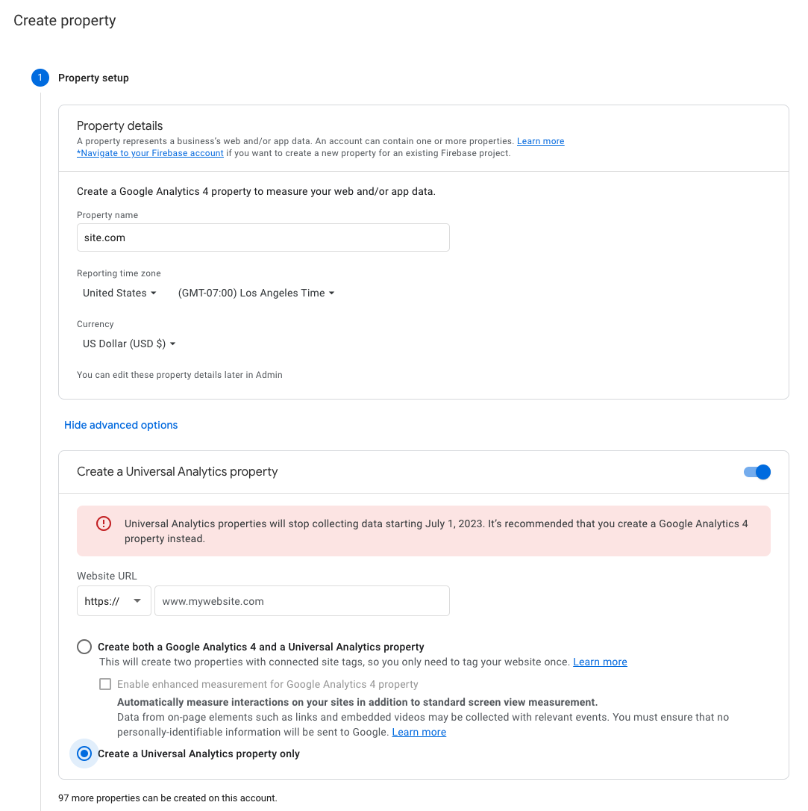

#### Track Personalization properties as Custom Dimensions in GA

Navigate to the Admin > Property area of Google Analytics. Expand Custom Definitions and select Custom Dimensions: 

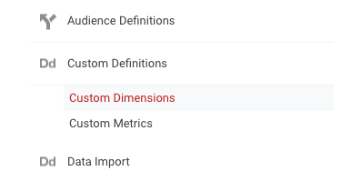

Add new Custom Dimensions that correspond to the identifiers. Most dimensions will be set to “hit,” as they change based on user behavior. For geotargeting, you will want to set the scope to "Session" to allow the setting to persist.


Take note of the Index for each of your new Custom Dimensions, as you will need them to configure your Variables in Google Tag Manager. Your indexes will differ from this example if you have pre-existing configurations.

At this time, you can verify that the identifiers are accurately pushing data into the dataLayer, if you like. Refer to  the [Test and Debug](#test-and-debug) section for more info. 

### Configure Google Tag Manager

#### Create Variables in GTM

Within Google Tag Manager, create User-Defined Variables to capture each of your personalization identifiers.


Select **Data Layer Variable**


Create Variables following these best practices:


1. Use a common prefix for each of your variable names to help group and identify them. In this example, we use “dlv” to signify “data layer variable”.
2. Include the Custom Dimension Index ID in your variable name, so it's easy to reference.
3. Don't forget the actual name of the variable.
4. When you create new variables that include text, we highly recommend that you format the value and force it to be lowercase.

5. Keep the data Layer at Version 2.
6. Do not set a Default Value.
7. The Data Layer Variable Name is the most important, so ensure you spell everything identically to what the DataLayer is pushing. In our case, these names are:
  a. audience.geo
  b. interest
  c. role

#### Append Variables to Your Google Analytics Settings in Tag Manager

Now that you have your variables, you can attach them to your Google Analytics Settings Variable. Yours might be called something different but the “Type” will be the same. If you do not have this kind of variable and instead are using a “Constant” or have hardcoded the UA ID in each tag, you will want to change that in favor of GTM tags to ensure future usability. Your Settings should appear in the list of Custom Variables.


1. Edit the Google Analytics Variable settings
2. Expand the “More Settings” fieldset
3. Expand Custom Dimensions.
4. Click “Add More Dimensions”
5. Create an entry for each of your custom dimensions, ensuring your Index and Dimension Values are correct


## Test and Debug

In your Google Tag Manager implementation, click “Preview” in your Workspace to debug. If you are new to using Preview, please refer to the [Preview and debug containers](https://support.google.com/tagmanager/answer/6107056?hl=en) support documentation on Google Tag Manager Support.


Use the [DataSlayer Chrome extension](https://chrome.google.com/webstore/detail/dataslayer/ikbablmmjldhamhcldjjigniffkkjgpo) to verify data is accurately being sent to Analytics. You should see Data Layer properties correspond directly to what is pushed to Google Analytics. And, you should see your personalization values with the Custom Dimension Index numbers you previously set up. 


## Click Tracking & Goal Setup

This section will cover how to capture clicks on a particular link and set up a goal with Google Analytics. For this example, we will use Google Tag Manager to capture the “View recipe” click as an event, and set it up as a goal in Google Analytics.


With dataSlayer, we can observe the dataLayer push that happens when we click on the “View recipe” button. It's a link click and has a unique Click Text – namely, “View recipe.” These are the values you will use in Google Tag Manager:


### Create New Tag in GTM

1. In the workspace for your GTM account, visit the "Tags" menu. Click the "New" button to create a Tag that will capture the information you are looking for;  in this example, you want to know how often  people click on the “View recipe” button. Our recommended Tag configuration is below. There are no best practices at this time, so feel free to make modifications as needed. 
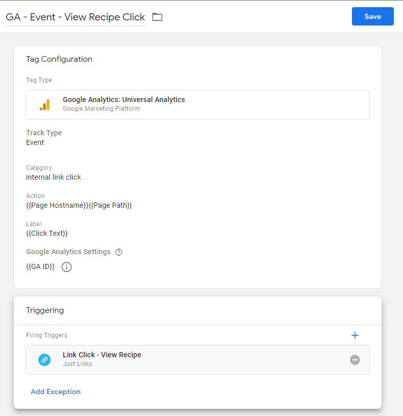
2. Scroll beyond the "Tag Configuration" section below it and click the gray circle.

2. Click on the + in the upper right hand corner to create a new trigger

3. Click on the gray circle again and select the “Just Links” trigger type from the fly-out menu.
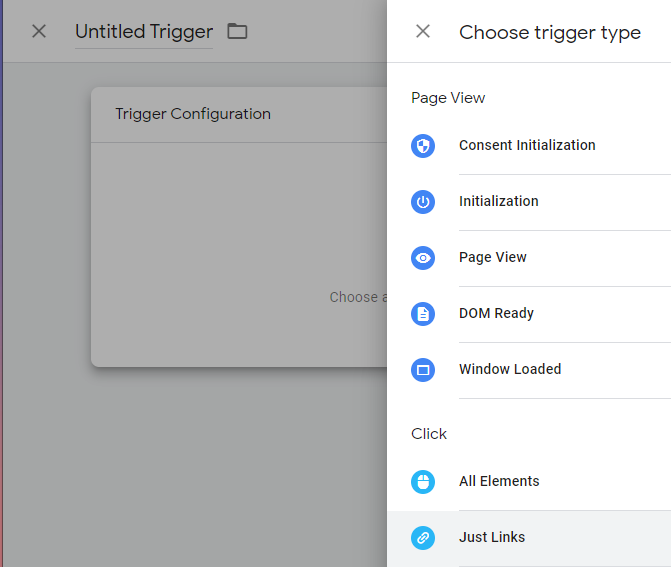
4. Fill out the form details for the trigger. Ensure you give it a name that is  easy to understand for anyone who refers to it in the future. In the example below, we've called it “Link Click - View Recipe.” To make the trigger specific to the “View recipe” button, select **Some Link Clicks**, instead of Al**l Link Clicks**. Be sure to specify that **Click Text** needs to **match RegEx** of “View recipe, which is  the value we got from the dataSlayer extension. Save the trigger.


You now have a fully working Tag and corresponding Trigger.


To test that the Tag and Trigger are functioning as expected, you will use “Preview” mode. In GTM, you will see your tag firing when you click on the link.


In dataSlayer you will see your event firing with the expected values that you previously set up in your tag. 

In this case:

* category: internal link click
* action: (your URL)
* label: View recipe 


After you test your new event, make sure to **Publish** your changes by pressing the "Submit" button in your Workspace.


### Goal Setup in Google Analytics

1. Navigate to the Goal section of your view and click + **New Goal**
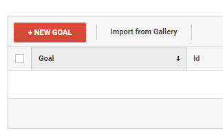
2. Name your goal and select “Event” as the type. Click **Continue**.

3. Input the condition of the goal. In this case, you need the label value that was generated in the previous section:
  * label: View recipe 
Based on this information, enter the value of “label” into the Label field. Ensure that you change the default “Equals to” condition to “Regular expression,” which makes the matching more flexible.
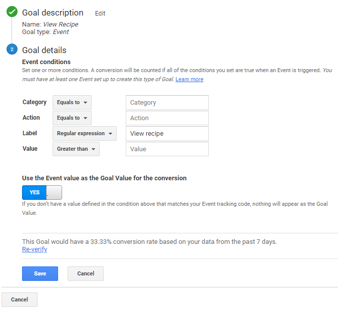
4. Save the goal.

## Reporting

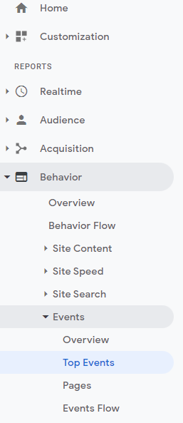

To find your new data, login to Google Analytics. In the main navigation, go to Behavior > Events > Top Events. 


Click on the “Secondary dimension” button, right below the Event Category. You should now see the custom dimensions you created earlier. Clicking on any of them, will display the associated data.

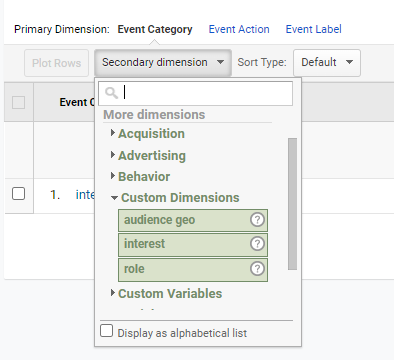

You are able to toggle between the different custom dimensions by clicking on the same area and switching them.


### Segmentation

You are able to create segments based on your custom dimensions to slice and dice your data.  Most reports in Google Analytics will allow you to  segment your data by clicking on the “+ Add Segment” button.


You may see a list of existing segments. Create a new segment by clicking on the “+New Segment” button.


Under Advanced, choose “Conditions” and select the kind of segment you want to create. In this example, we want to see how Canadian session behavior differs from all other visitors.  In the dimension field, find the appropriate dimension and click on it – in this case: “audience geo.”

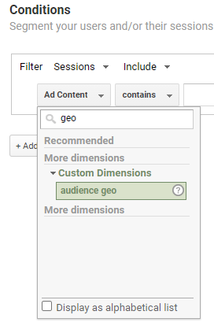

We are looking for Canadian visitors, so the custom dimension should contain a value of “ca”. Name and save your segment. We’ll call ours “Audience Geo - Canada.”

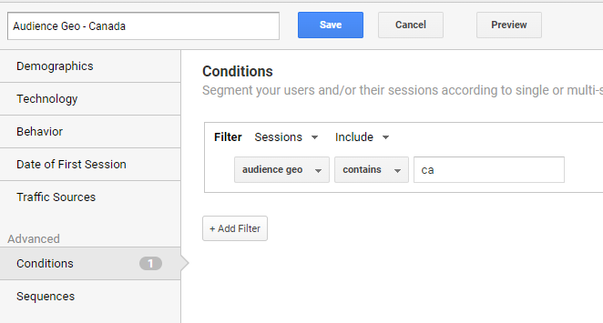

Create additional segments in your reports, like a US geo audience, to compare outcomes.  

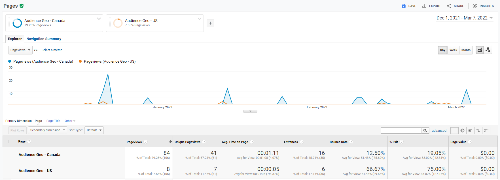

Adding audiences to your Goals is particularly useful. Tying this back to our previous Recipe Click goal, if we add our US and Canadian audiences, we can compare outcomes. If we're more interested to see click-through rates based on audience interest, we could do that, too!

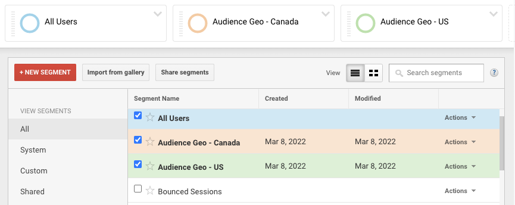

Below, we can see how different audiences convert towards the same Goal.

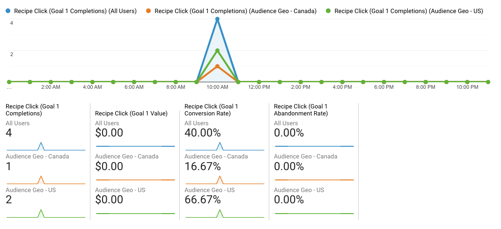
