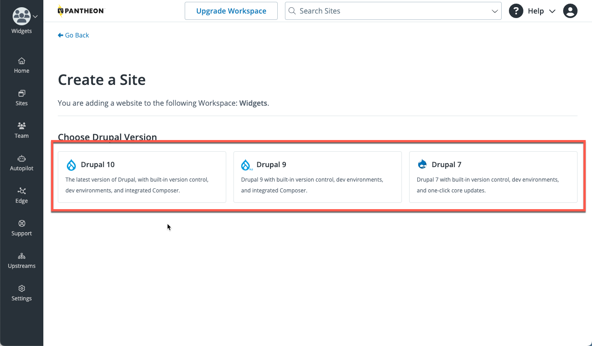
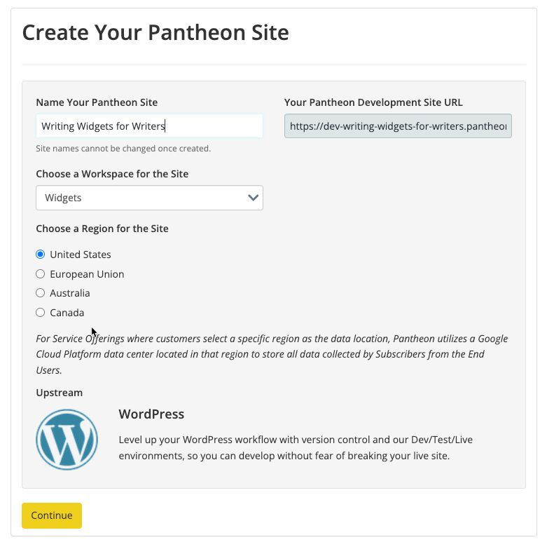

There are dozens of ways to add a site on Pantheon. This section covers the most common scenarios for new users: creating a new CMS site (a site running WordPress or Drupal), or migrating an existing WordPress or Drupal site.  For additional scenarios, see the [More Resources](/guides/getstarted/addsite#more-resources) section at the end of this document.

## Create a New CMS Site

To create a CMS site:

1. Open your Personal or Professional Workspace dashboard and select the yellow <Icon icon="plus" text="Create New Site"/> button on the lower right side of the page.

   

1. Select **WordPress** or **Drupal**.

   

   If you select Drupal, you will have the option to select the Drupal version you want to use.

   

1. Enter the name and select a region for this site. If this site is to be part of a Professional Workspace, select a Workspace from **Choose a Workspace for the Site**. Click **Continue**. It can take several minutes to create a new site on Pantheon.

   

   <Alert title="Note" type="info" >

   You can navigate away from this page during this process, but later, you'll have to go to the **Sites** tab to access your site.  If possible, stay on this tab to simplify accessing the site when the creation is complete.

   </Alert>

1. Click **Visit your Pantheon Site Dashboard** when the process is complete.

   

At this point, you have a Dev environment for your site code, but you do not have a Dev environment for your CMS.  To create that:

1. Click **Site Admin**. A new browser tab will open, and you will be presented with your CMS setup screen.

1. Enter the information on the screen, and when done, return to the browser tab containing your Site Dashboard.

   <Alert title="Note" type="info">

   Be sure to record your new username and password.

   </Alert>

You have successfully finished adding a site in its Dev environment!

## Migrate an Existing Site

If you already have a site hosted elsewhere, you can move it over to Pantheon with minimal effort.

<Alert title="Warning" type="danger" >

If your migration needs include any of the following, **do not use this process**, and instead refer to the specified documentation:

<Partial file="migrate/manual-when-all.md" />
<Partial file="migrate/manual-when-drupal.md" />
<Partial file="migrate/manual-when-wordpress.md" />

</Alert>

### Before you Begin

1. Check your plugins and/or modules against [Modules and Plugins with Known Issues](/modules-plugins-known-issues).

1. Make sure your code is compatible with the latest recommended version of PHP for your CMS. If not, be prepared to [adjust PHP versions](/guides/php/php-versions/#configure-php-version).

1. Remove unneeded code, database tables, and files.

### Perform the Migration

<Partial file="migrate/manual-all.md" />

You have successfully migrated a site to its Dev environment!

Now it's time to purchase a site plan in preparation for launching your site.

## More Resources

* [Migrate a Composer Managed Drupal Site from Another Platform](/guides/drupal-unhosted-composer)
* [Import Drush Site Archives with Terminus](/guides/drush/drush-import)
* [Migrate a Drupal Site from Another Platform](/guides/drupal-unhosted)
* [Manually Migrate Sites to Pantheon](/migrate-manual)
* [Create a Static Site Using an Empty Upstream](/static-site-empty-upstream)
* [Create a Drupal Site Using a Drupal Distribution](/guides/drupal-from-dist)
* [Using Terminus to Create and Update Drupal Sites on Pantheon](/terminus-drupal-site-management/)
* [Create a WordPress Site with Terminus and WP-CLI](/guides/create-wp-site)