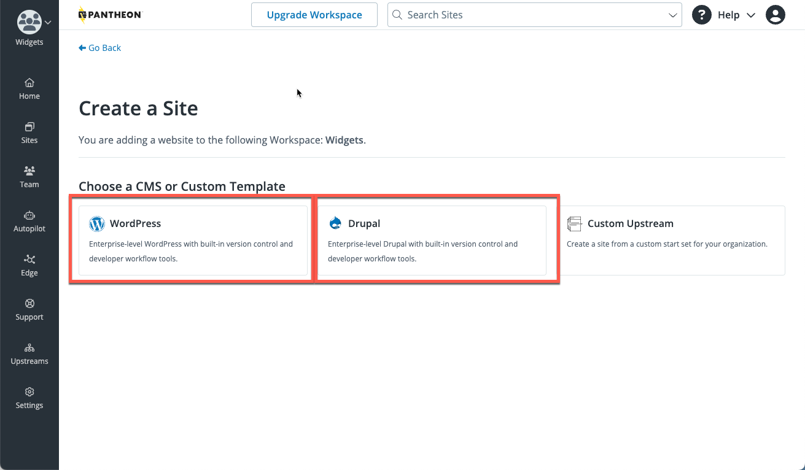
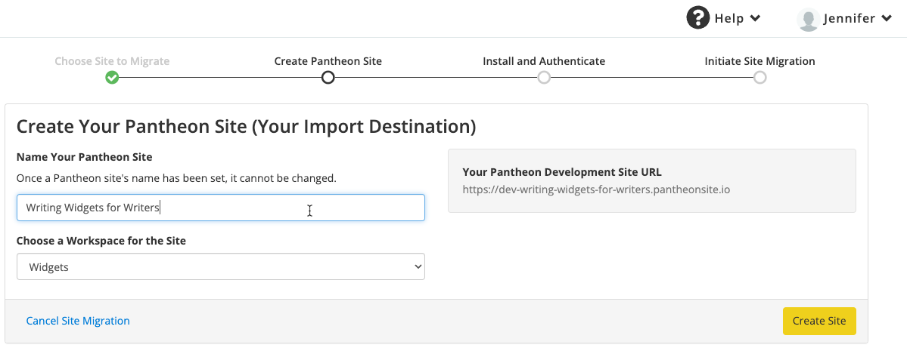
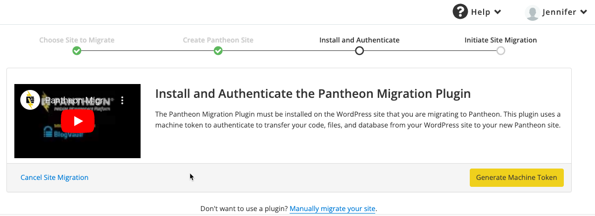
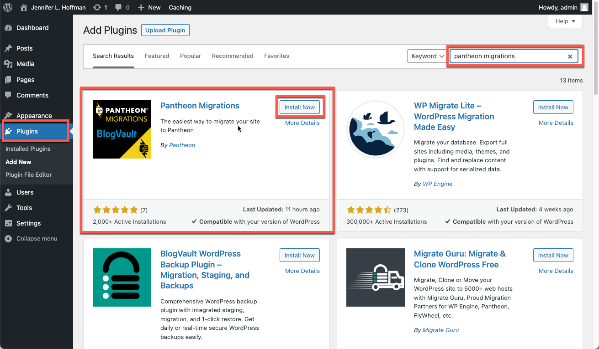
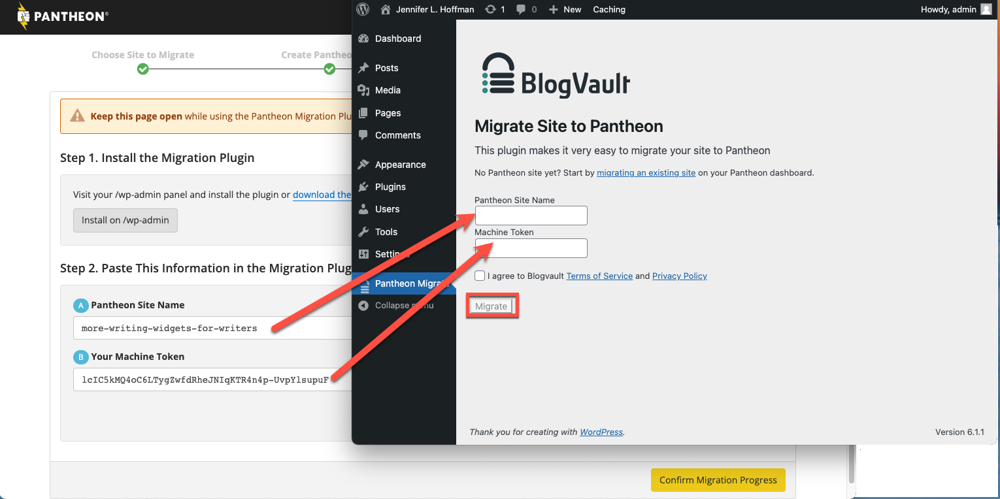

There are literally dozens of ways to add a site on Pantheon.  This page will cover the most common scenarios for new users: creating a new CMS site, or migrating an existing WordPress or Drupal site.  For additional scenarios, see the More Resources section at the end of this document.

## Create a New CMS Site

A CMS site is a site that runs either WordPress or Drupal as the content management system (CMS). 

To create a CMS site:

1. On your Personal or Professional Workspace dashboard, select the yellow <Icon icon="plus" text="Create New Site"/> button on the lower right side of the page.
   
   

1. Select WordPress or Drupal.

   

   If you select Drupal, you will have the option to select the Drupal version you wish to use.

   

1. Enter the name and select a region for this site. If this site is to be part of a Professional Workspace, select a Workspace from **Choose a Workspace for the Site**.

   

1. Click **Continue**. It can take several minutes to create a new site on Pantheon. 

   

   <Alert title="Note" type="info" >
   
   You can navigate away from this page during this process, but later, you'll have to go to the **Sites** tab to access your site.  If possible, stay on this tab to simplify accessing the site when the creation is complete.
   
   </Alert>

1. Click **Visit your Pantheon Site Dashboard** when the process is complete. 

At this point, you have a Dev environment for your site code, but you do not have a Dev environment for your CMS.  To create that:

1. Click **Site Admin**.  A new browser tab will open, and you will be presented with either Drupal or WordPress setup screens.  Enter the information in these screens, and when done, return to the browser tab with your Site Dashboard.

   <Alert title="Note" type="info">

   Record your new username and password. You’ll need this information again soon.

   </Alert>

You have just finished adding a site in its Dev environment!

## Migrate an Existing Site

If you already have a site hosted elsewhere, you can move it over to Pantheon with minimal effort.

<Alert title="Warning" type="danger" >

If your migration needs include any of the following, **do not use this process**, and instead refer to the specified documentation:

- You are moving a Drupal site **and** want to upgrade to the latest version of Drupal: 
   - Your site *is* Composer-managed: [Migrate a Composer Managed Drupal Site from Another Platform](/guides/drupal-unhosted-composer) or [Import Drush Site Archives with Terminus](/guides/drush/drush-import)
   * Your site is *not* Composer-managed: [Migrate a Drupal Site from Another Platform](/guides/drupal-unhosted)|
- You are using WordPress Multisite: [Manually Migrate Sites to Pantheon](/migrate-manual) 
- You are migrating a site that is only on your local machine: [Manually Migrate Sites to Pantheon](/migrate-manual)
- The site or site archive is greater than 500MB: [Manually Migrate Sites to Pantheon](/migrate-manual)
- You are using WordPress and don't want to install the plugin required for migration [Manually Migrate Sites to Pantheon](/migrate-manual)

</Alert>

### Before you Begin

1. Check your plugins and/or modules against [Modules and Plugins with Known Issues](/modules-plugins-known-issues).

1. Make sure your code is compatible with the latest recommended version of PHP for your CMS. If not, be prepared to [adjust PHP versions](/guides/php/php-versions/#configure-php-version).

1. Remove unneeded code, database tables, and files.

### Perform the Migration

<TabList>

<Tab title="WordPress" id="tab-1-id" active={true}>

This process will install a WordPress plugin.  If you don't want to use a plugin, migrate your site manually.

1. On your Personal or Professional Workspace dashboard, select the yellow <Icon icon="plus" text="Create New Site"/> button on the lower right side of the page.

   

1. Enter your current website URL, select **WordPress** and click **Continue**.

   

1. Enter the name of your new Pantheon site, select a workspace for the site (optional), and click **Create Site**.
   
   

1. Select **Generate Machine Token** and re-authenticate if prompted.  Keep the Pantheon tab open in your browser.

   

1. Select **Install on /wp-admin**, then search for and install the plugin.

   
   
1. Click **Activate**. Copy the machine token from the Pantheon Dashboard, then navigate to **Pantheon Migration** within the WordPress Dashboard on your existing site. Paste the machine token and the site name.

   

1. Click **Migrate**. When the migration is complete the **Migration completed successfully** page appears.

   

1. After the migration is complete, return to Pantheon tab and click **Confirm migration progress**.  Your site's dashboard appears.

You have successfully added a site in its Dev environment!

</Tab>

<Tab title="Drupal" id="tab-2-id">

The recommended way to migrate Drupal sites from another host is to use `drush ard` (Drush 8 or earlier) to create an archive that can be easily imported.

1. On your Personal or Professional Workspace dashboard, click the **Migrate Existing Site** button.

   

1. Enter your current website URL, select **Drupal 7** or **Drupal 8**, and click **Continue**.

   

1. Enter the name of your new Pantheon site, select a workspace for the site (optional), and click **Create Site**.
   
   

1. Follow the instructions to **Create an Archive of Your Existing Site With Drush**:

  

  The Dashboard instructs you to put the archive on your existing website, but you can put the site archive on Dropbox, S3, or any number of other places. The important thing is that you have a site archive that can be downloaded via a publicly accessible URL.

  Click **Continue Migration**

1. On the right side of the page, paste a publicly accessible URL to a download of your site archive. If you are using a Dropbox URL, change the end of the URL from `dl=0` to `dl=1` so we can import your site archive correctly.

   

1. Click **Import Archive**. Click **Visit the Site Dashboard** from the Site Dashboard on Pantheon after the imported is complete.

 

You have successfully migrated a site to its Dev environment!

</Tab>

</TabList>

## More Resources

* [Migrate a Composer Managed Drupal Site from Another Platform](/guides/drupal-unhosted-composer)
* [Import Drush Site Archives with Terminus](/guides/drush/drush-import)
* [Migrate a Drupal Site from Another Platform](/guides/drupal-unhosted)
* [Manually Migrate Sites to Pantheon](/migrate-manual)
* [Create a Static Site Using an Empty Upstream](/static-site-empty-upstream)
* [Create a Drupal Site Using a Drupal Distribution](/guides/drupal-from-dist)
* [Using Terminus to Create and Update Drupal Sites on Pantheon](/terminus-drupal-site-management/)
* [Create a WordPress Site with Terminus and WP-CLI](/guides/create-wp-site)