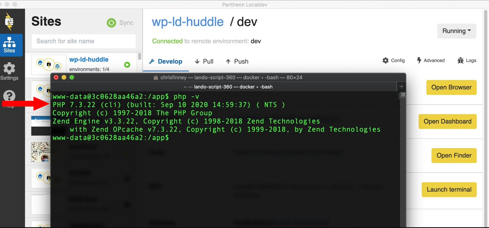

Localdev has been deprecated. However, there are many local development options for the Pantheon platform in the [Local Development on Pantheon](/guides/local-development) guide.

## Troubleshooting

This section provides solutions to common troubleshooting scenarios. Note that Localdev has been deprecated. We recommend that you use [other local development tools](/guides/local-development) to maintain your site.

### Clone Failed Due To Modified .gitignore

Older WordPress sites on Pantheon that have removed the `wp-content/uploads` folder from their site's `.gitignore` file will fail when pulling locally. The logs may show something similar to:

```bash
{"level":"error","message":"pulling files from dev errored with:
mkdir: cannot create directory '/app/./wp-content/uploads':
File exists\n","label":"myawesomesite","timestamp":"2020-11-25T16:40:12.057Z"}
```

The content of `wp-contents/uploads` should be symlinked to files, in keeping with the [code moves up, content moves down](/pantheon-workflow#code-moves-up-content-moves-down) best practice of the Pantheon WebOps workflow.

### Clone of a New Site Failed

If you attempt to initialize a site within Localdev before you've completed the CMS install on Pantheon, it will fail when attempting to pull the (non-existent) database from the platform. The logs under **show detail (beta)** will show:

```docker
Pulling your database... This might take a minute
 [notice] Command: anita-wordpress.dev -- wp db export [Exit: 0]
Checking db pull for expected tables...
Database pull failed...
```

See step 9 of [Create a Site](/guides/legacy-dashboard/create-sites#create-a-site).

### Log out and Reset to Defaults

The steps in this section should only be used as a last resort. This resets Localdev and will remove the machine token and all local copies of your connected sites.

1. Click **Settings**.

1. Click **Reset to defaults**.

1. Click **Proceed with reset**.

## FAQ

### What does Localdev do about existing Lando config files?

While Localdev uses parts of Lando under the hood, they should be considered separate tools. Localdev will not respect existing Lando configuration files, and we recommend keeping the two tools separate. That is, if you are going to use both tools, they should point to separate project directories.

### Can WordPress Site Networks be developed through Localdev?

At this time, WordPress Site Network (also known as WordPress Multisite) is supported only for networks using subdirectories, not subdomains. See the [Choose Between Subdirectories and Subdomains](/guides/multisite/considerations/#choose-between-subdirectories-and-subdomains) section of our [WordPress Site Networks](/guides/multisite) guide for more information.

### How do you configure PHP versions for sites in the Localdev environment?

Localdev will [respect the changes made to your local `pantheon.yml`](/guides/php/php-versions#configure-php-version) file.

A forced rebuild is required for changes in `pantheon.yml` to take effect:


You can verify which version of PHP your site is using by clicking **Launch Terminal**, then running `php -v`:



### Can I create Multidev environments from Localdev?

No, new Multidev environments must still be created from the Site Dashboard or [Terminus](/terminus/commands/multidev-create).

### Can I setup Localdev with a Mac that has an M1 chip?

Yes, Macs with the M1 chip are supported.

## More Resources

- [Local Development on Pantheon](/guides/local-development)