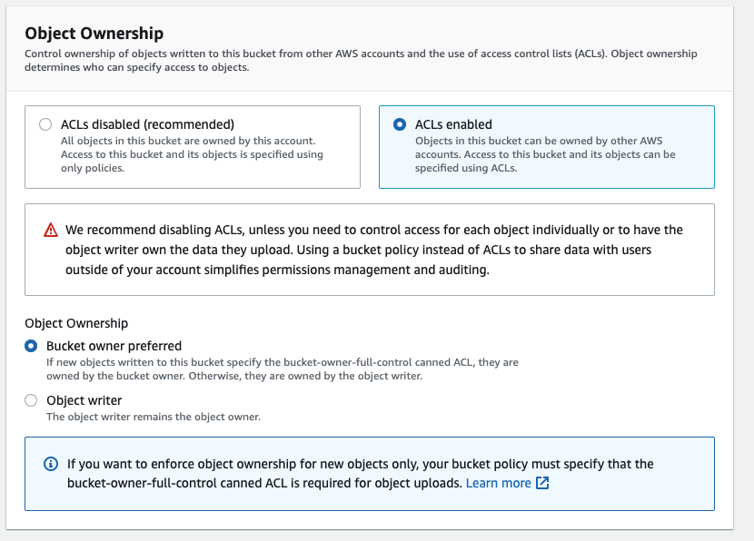
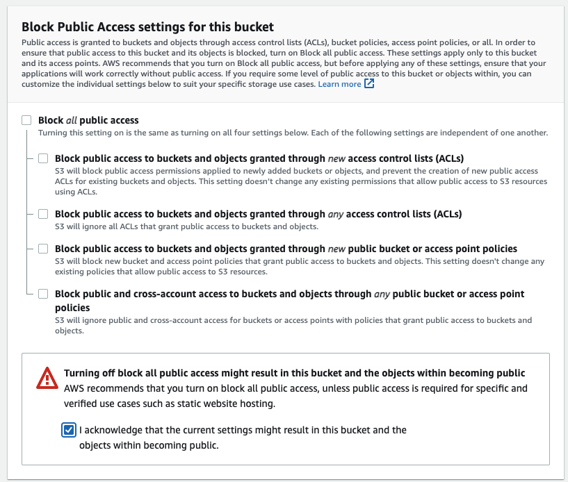
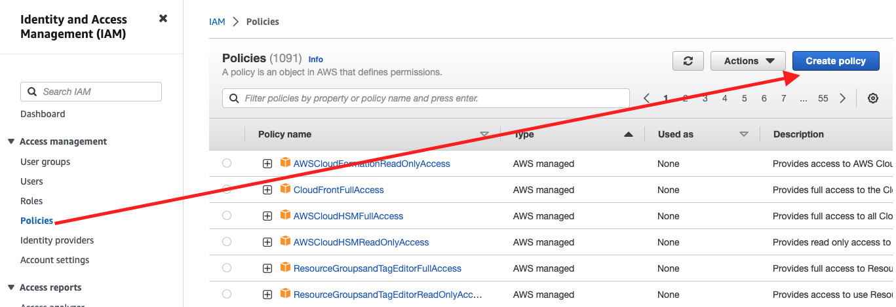
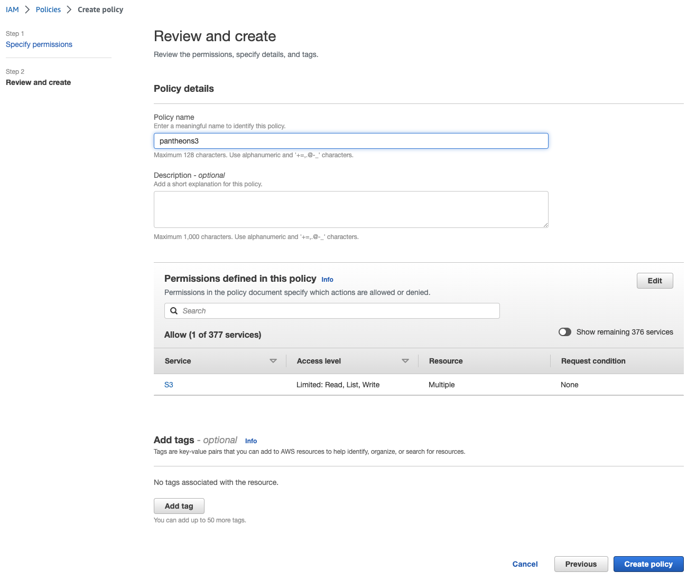

This section provides information on how to integrate Amazon Web Services (AWS) S3 storage with your WordPress Pantheon site.

AWS offers Simple Storage Service (S3) for scalable storage and content distribution that you can integrate with sites running on Pantheon. Pantheon already offers content distribution through our [Global CDN](/guides/global-cdn), but S3 is a good option for addressing issues with [highly populated directories](/guides/platform-considerations/media-email-support#large-files-and-highly-populated-directories) or [serving large files](/guides/filesystem/large-files).

## Before You Begin

Be sure that you have:

- An existing WordPress site on Pantheon, or [create](https://dashboard.pantheon.io/sites/create) a site.
- A [local clone](/guides/git/git-config#clone-your-site-codebase) of your code repository.
- An account with [Amazon Web Services (AWS)](https://aws.amazon.com/s3/). Amazon offers [free access](https://aws.amazon.com/free/) to most of their services for the first year.
- [Terminus](/terminus) installed on your local computer.

<Alert title="Exports" type="export">

This process uses [Terminus](/terminus) commands. Set the variable `$site` in your terminal session to match your site name before you begin:

```bash{promptUser: user}
export site=yoursitename
export env=dev
```

</Alert>

## Configure S3 within the AWS Console

You must configure the service within your [AWS Management Console](https://console.aws.amazon.com) before integrating S3 with your Pantheon site.

### Create a New AWS S3 Bucket

 Create a bucket if you do not already have one for your site.

1. Open your [AWS Console](https://console.aws.amazon.com) and click **S3**.

1. Click **Create Bucket**.

1. Enter a bucket name. The bucket name you choose must be unique across all existing bucket names in Amazon S3. You can not change the name after you create a bucket. Note that the bucket name you choose is visible in the URL that points to the objects stored in the bucket. Then, select an AWS Region.

   

1. Under the **Object Ownership** section, select the **ACLs enabled** and Object Ownership should be **Bucket owner preferred**.

   

1. Under the **Block Public Access settings for this bucket** section, uncheck the **Block all public access** an check the acknowledgement of that setting.

1. Leave other setting to default and review your settings, and then click **Create bucket**.

### Configure your AWS Access

1. First, you need to configure you S3 user's access policy via Identity and Access Management, under `Access Management` and `Policies`, click the `Create policy` button.

   

1. Select `JSON` and paste this under the `Policy editor`(You will need to change the `bucketname` that you specified from the previous section):

   ```bash{promptUser: user}
   {
     "Version": "2012-10-17",
     "Statement": [
       {
         "Sid": "ObjectLevel",
         "Effect": "Allow",
         "Action": [
           "s3:PutObject",
           "s3:GetObject",
           "s3:DeleteObject"
         ],
         "Resource": "arn:aws:s3:::bucketname/*"
       },
       {
         "Sid": "BucketLevel",
         "Effect": "Allow",
         "Action": [
           "s3:GetBucketPublicAccessBlock",
           "s3:GetBucketOwnershipControls",
           "s3:ListBucket",
           "s3:GetBucketLocation"
         ],
         "Resource": "arn:aws:s3:::bucketname"
       }
     ]
   }
   ```
   
   

   Then hit `Next` button.

1. Specify your `Policy Name` (eg: Pantheons3Access) and hit the `Create Policy`.

   
   
   

1. Going back under `Access Management` and `Users`, click the `Add users`.

1. Specify the `User name` (eg: S3-user) and hit `Next`.

1. Under `Permissions options`, select `Attach policies directly`. Find the policy that you created from step 3.

   <Alert title="Note" type="info">
   Steps 1-3 will create a custom AWS User policy that is enough to read and write to your specific bucket assigned specifically to your site. If you will be having read or write issues, you can choose `AmazonS3FullAccess` policy to replace the custom policy that you created.
   </Alert>


## Integrate S3 with WordPress

You must install a plugin such as [S3 Uploads](https://github.com/humanmade/S3-Uploads) or [WP Offload Media](https://wordpress.org/plugins/amazon-s3-and-cloudfront/).

WP Offload Media requires a paid license but is configurable in the WordPress admin UI and offers a number of options and features, including multisite support. S3 Uploads is open-source but does not include an admin UI and requires [Terminus](/terminus) and [WP-CLI](/guides/wp-cli) for setup and migration.

### Install and Deploy S3 Uploads

<Alert title="Note" type="info">

This plugin has known [multisite issues](https://github.com/humanmade/S3-Uploads/pull/214). Consider [WP Offload Media](#install-and-deploy-wp-offload-media) if you need an alternative plugin with premium support and a multisite version.

</Alert>

1. Download the latest plugin release from [Github](https://github.com/humanmade/S3-Uploads/releases) and extract it to `wp-content/plugins/`. Note that our documentation has been tested for version 2.0.0.

  <Alert title="Warning" type="danger">

  **Do not** add the plugin as a Git submodule. Git submodules are not supported on the platform. Refer to the [Git guide](/guides/git/faq-git) for more information.

  </Alert>

1. Rename the extracted folder to remove the version number. For example:

   ```bash{promptUser: user}
   mv S3-Uploads-2.0.0/ S3-Uploads
   ```

1. Create and/or copy your **Access Key ID** and **Secret Access Key** from the **My security credentials** section of your AWS account to a text editor on your local computer.

   <Alert title="Note" type="info">

   Consider creating a unique user with limited permissions covering this S3 bucket to authenticate the plugin as a standard security measure.

   </Alert>

1. Add the credentials to `wp-config.php`, as described in the plugin's [README](https://github.com/humanmade/S3-Uploads#getting-set-up) file. For increased security, we recommend a service like [Lockr](/guides/lockr) or the [Terminus Secrets plugin](https://github.com/pantheon-systems/terminus-secrets-plugin) to store and retrieve these credentials securely.

1. Commit and push the new plugin and your `wp-config.php` file updates to the Dev environment, then switch to SFTP mode and activate the plugin:

    ```bash{promptUser: user}
    terminus wp $site.dev plugin activate S3-Uploads
    ```

1. Use WP-CLI to verify your AWS setup.

    ```bash{promptUser: user}
    terminus wp $site.dev s3-uploads verify
    ```

#### Migrate existing media with S3 Uploads and WP-CLI

You can migrate existing media files to S3 with the following command:

```bash{promptUser: user}
terminus wp $site.dev -- s3-uploads migrate-attachments
```

Optionally, add the `--delete-local` flag to remove the local copies of the media files.

This command will also provide a search/replace command for your database to update references to the newly-migrated files when completed. Note that you must run this on all Pantheon environments (Dev, Test, and Live).

#### Multisite Compatibility

WP Offload Media plugin is supported.

Refer to the [WP Offload Media documentation](https://deliciousbrains.com/wp-offload-media/doc/multisite-per-subsite-bucket-and-custom-domain-settings/) for more information.

#### Additional Configuration

Check out the plugin's [README file](https://github.com/humanmade/S3-Uploads/blob/master/README.md) for information on advanced configuration, such as cache control, URL rewriting, and offline development.

### Install and Deploy WP Offload Media

Follow documentation from [DeliciousBrains](https://deliciousbrains.com/wp-offload-media/doc/quick-start-guide) to install and deploy WP Offload Media. No specialized configuration is required for this plugin to run on Pantheon.

## More Resources

- [Integrate Your Fastly Account on Pantheon with Amazon S3](/guides/fastly-pantheon/fastly-amazon-s3)
- [AWS S3 Setup for Drupal](/drupal-s3)
