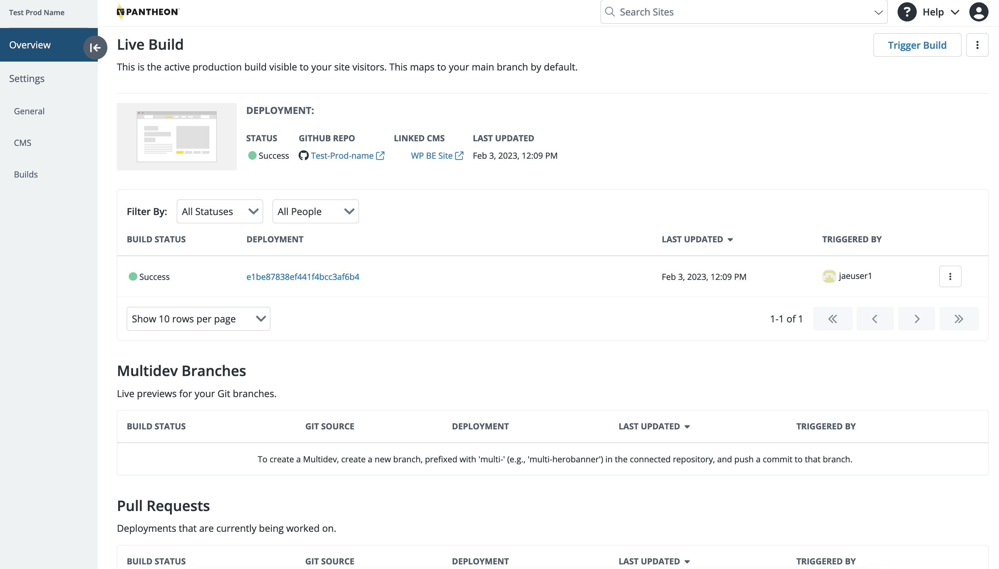

This section provides information on how to view Build details, how to trigger a new build manually in the Overview page, how to trigger a build with GitHub merges, Multidev branch builds, and pull request builds.

## Build Details

You can view build details and get information on your Front-End Site development and specifications. Build information is provided in the Overview page in three sections:

- Live Build
- Multidev Branches
- Pull Requests

Build details include:

- **Status:** The build’s latest status. Possible status values are:
    - `In Progress`
    - `Success`
    - `Failed`
    - `Queued`

- **Build:** The build number and reference ID.
- **Branch:** The name of the latest GitHub branch.
- **Deployment:** The URL to the environment that the build was deployed to.
- **Last Updated:** The date the site content was last modified.
- **Triggered by:** The name of the user who deployed the site build.

### View Build Details

1. [Go to the Site Dashboard](/guides/account-mgmt/workspace-sites-teams/sites#site-dashboard), then select the **Sites** page.

1. Click the **Front-End Sites** tab and select the site you want to view the build details for.



## Trigger a Manual Build

You can save time by quickly triggering a build from your Overview page.

1. Log in to your Front-End Site workspace and select the **Sites** page.

1. Click the **Front-End Sites** tab and select the site you want to trigger a build for.

1. Click the **Trigger Build** button in the top left corner.

## Trigger a Build with GitHub Merges

A build and deploy process is automatically triggered when you
push code to the default branch of your repository or merge a pull
request to that branch.

You can follow the steps below to observe the build and deployment process in real time. Note that the steps below assume that you have already cloned your Front-End Site repository from GitHub to your local.

1. Check out the `main` branch of your repository.

    ```bash{promptUser: user}
    git checkout main
    ```

1. Make a change to a file in your repository.

1. Add and commit the change to the `main` branch.

    ```bash{promptUser: user}
    git add .
    git commit -m <message>
    ```

1. Push the new commit.

    ```bash{promptUser: user}
    git push
    ```

1. Open your Site Dashboard, navigate to the **Overview** page and locate the **Live Build** section to observe the new build in progress.

## Multidev Branch Builds

Refer to [Multidev Workflow and Configuration](/guides/decoupled/overview/fes-multidev) for information on Multidev Branch Builds.