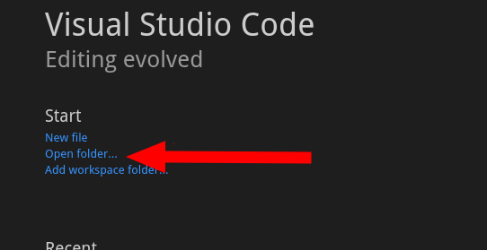

## Overview
[Visual Studio Code](https://code.visualstudio.com/), or **VS Code**, is an open-source code editor that runs on Windows, Linux, and Mac OS.

This doc covers setting up a Pantheon site in VS Code and using the SFTP extension to sync code between your Pantheon site and local machine.

## Before You Begin
1. [Create a site](/guides/legacy-dashboard/create-sites) on Pantheon, or browse to the Dev environment Dashboard of an existing site.
1. Use [SFTP](/guides/sftp/rsync-and-sftp#sftp), [rsync](/guides/sftp/rsync-and-sftp#rsync) or [Git](/guides/git/git-config#clone-your-site-codebase) to clone your site files on the Dev environment down to your local machine.

  If you intend to upload code changes via SFTP, place your site code in a subdirectory called "code" (e.g, `~/sites/mysite/code`). This aligns with the file structure on the platform when using [SFTP mode](/guides/sftp).

1. Download and install [VS Code](https://code.visualstudio.com/).


## Create a VS Code Workspace

In VS Code, a Workspace contains settings for your project, including recommended extensions, configuration for extensions, and project-specific debugging configuration.

1. From the Welcome screen, click **Open folder...** under the **Start** heading:

  

  If you have already closed the Welcome screen, click **Open...** in the **File** menu.

1. Navigate your filesystem and select the directory containing your site (e.g, `~/sites/mysite`).
1. Save this as a Workspace by selecting **Save Workspace As...** from the **File** menu.

Workspace settings are stored in a file called `.code-workspace` at the root of your project. It is recommended to keep this file out of Git by adding it to your `.gitignore` file at either the site or global level:

```git:title=.gitignore
// highlight-start
# Ignore VSCode Workspace Files
*.code-workspace
// highlight-end

# WordPress #
############
wp-config-local.php
wp-cli.local.yml
wp-content/uploads
wp-content/blogs.dir/
wp-content/upgrade/

```

At this point, you should see your site files in the File Explorer on the left side of VS Code. Click the file name to open it for editing in the main window.

## Deploy local code changes to a Pantheon environment

Once you've made some code changes, you'll want to push those up to your Pantheon Dev or Multidev environment. You can do this using Git, or with SFTP.

### Push changes with Git (recommended)

VS Code includes Git integration and an integrated terminal, either of which can be used to make Git changes and push them back to your Pantheon repository and Dev environment.

Make sure your site is in [Git mode](/guides/quickstart/connection-modes) before pushing code via Git.

#### Git Version Control in VS Code

Open the Git menu (**Ctrl** + **Shift** + **G** or **View** -> **SCM**). From here you can review your outstanding changes, commit them with a message, switch branches and more. Visit the [VS Code docs](https://learn.microsoft.com/en-us/visualstudio/version-control/) for more information.

#### Integrated Terminal

Open the [integrated terminal](https://code.visualstudio.com/docs/editor/integrated-terminal) with **Ctrl** + **`** or **View** -> **Terminal**. Now you can interact with Git as you would normally, without leaving VS Code.

### Upload your changes with SFTP

The SFTP extension for VS Code allows developers to upload code to the Pantheon Dev or Multidev environment directly from VS Code, as well as download files from the Pantheon servers.

Make sure your site is in [SFTP mode](/guides/sftp) before uploading code via SFTP.

1. Install the VS Code [SFTP Extension](https://marketplace.visualstudio.com/items?itemName=liximomo.sftp).
1. Open the VS Code command palette (**Ctrl/Command** + **Shift** + **P**) and run `SFTP: config` to open the SFTP config file.
1. Edit the file using the connection information from your Site Dashboard, under the **Connect with SFTP** button in **Development Mode**. Remove the `remotePath` line, as the path is subject to change and you'll be automatically directed to the correct location:

  ```json:title=sftp.json
  {
      "name": "My Site",
      "host": "appserver.dev.YOUR-SITE-UUID.drush.in",
      "protocol": "sftp",
      "port": 2222,
      "username": "dev.LOGIN-UUID",
      "uploadOnSave": true
  }
  ```

1. If you have an [SSH Key](/ssh-keys) added to your Pantheon account, include the path to it:

  ```json:title=sftp.json
  {
      "name": "My Site",
      "host": "appserver.dev.YOUR-SITE-UUID.drush.in",
      "protocol": "sftp",
      "port": 2222,
      "username": "dev.LOGIN-UUID",
      "uploadOnSave": true,
      //highlight-next-line
      "privateKeyPath": "/Users/localUser/.ssh/id_rsa"

  }
  ```

  If you aren't using a key, you'll be prompted to enter a password when using SFTP. See [Dashboard Credentials](/guides/sftp) for more information.

  <Alert title="Warning" type="danger">

  If, while using an RSA key, you get the error `Error while signing data with privateKey: error:06000066:public key routines:OPENSSL_internal:DECODE_ERROR`, you must convert your key to PEM format:

  ```bash
  ssh-keygen -p -m PEM -f ~/.ssh/id_rsa
  ```

  This may have unintended consequences if you're using this key to authenticate to other systems. We recommend making a new key specifically for this application to convert.

  For more details, see [this issue](https://github.com/liximomo/vscode-sftp/issues/594) on the [vscode-sftp](https://github.com/liximomo/vscode-sftp) plugin GitHub repo.

  </Alert>

1. With `uploadOnSave` set to `true`, the next time you save changes to a file it will automatically be pushed to Pantheon.
1. [Commit your files to Git using the Pantheon Dashboard](/guides/sftp/sftp-development).

## CMS-specific Extensions

VS Code's basic functionality can be extended by adding third-party extensions, and a number of these exist for Drupal, WordPress, and PHP. Refer to the sites below for useful CMS-specific extensions.

* Drupal: [Drupal.org - Configuring Visual Studio Code](https://www.drupal.org/docs/develop/development-tools/configuring-visual-studio-code)
* WordPress: [Delicious Brains - Using VS Code for WordPress Development](https://deliciousbrains.com/vs-code-wordpress/)
